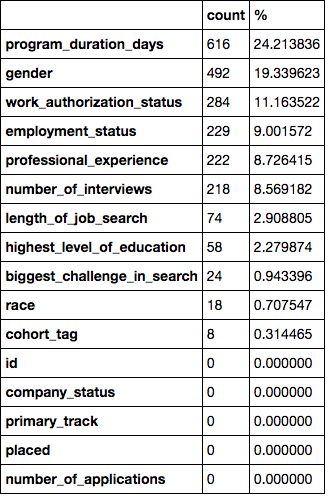
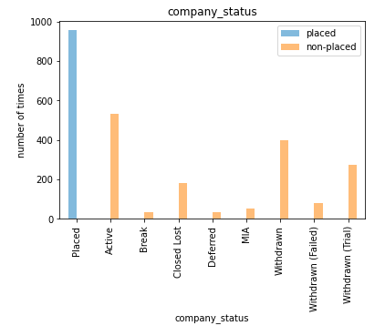
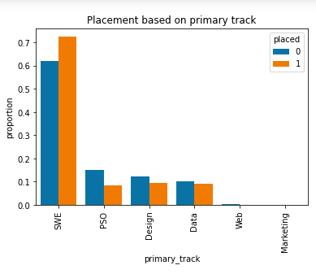
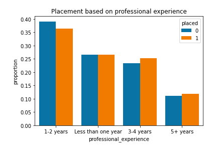
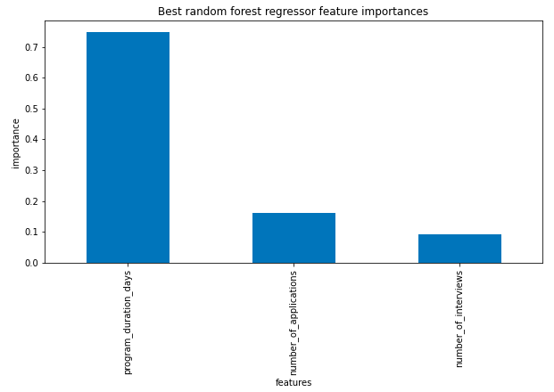
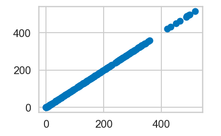
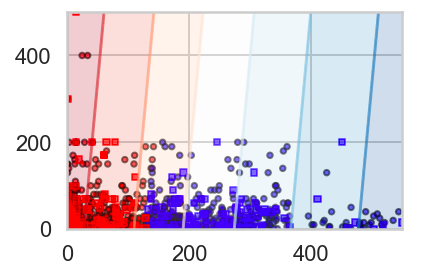

```python
from IPython import display
display.Image("./Pathrise logo.png")
```


    

    


# About Pathrise

Pathrise is an online program that provides 1-on-1 mentorship, training, and advice to help job seekers get the best possible jobs in tech. Every two weeks, Pathrise welcomes a new cohort of fellows. If a candidate is interested in joining our program and successfully passes all stages of our admission process, they receive an offer to join Pathrise and become a fellow. The first 2 weeks in the program are called a free trial period and a fellow can withdraw within this free trial period without any penalty. After 2 weeks, a fellow needs to sign an ISA (Income Share Agreement) with us if they want to stay in the program. The entire program lasts up to a year, including 8 weeks of the core curriculum. If a fellow is unable to find a job within a year after joining Pathrise, his/her contract is terminated. However, there might be some exceptions. For instance, if someone was on a break, we may extend their contract for the period of the break. On average, for fellows who stayed after their free trial period, it takes about 4 months to receive a final job offer. However, there is a lot of variation in fellows’ outcomes.

# Analysis Goal

Derive insights around if a fellow will ultimately be placed at a company and how long until a placement can be expected

# 1. Data

Pathrise collects info from its fellows throughout their program. Each fellow provides info such as their work authorization, employment status, primary track, professional experience, gender, and race. Pathrise then records number of interviews each fellow gets, number of applications turned in, and how many days each fellow spent before getting a job or withdraw. Pathrise provides these info for analysis to derive insights around if a fellow will ultimately be placed at a company and how long until a placement can be expected

# 2. Method

There are many variables to consider when figuring out placement of a fellow. Some of the variables were not quantifiable directly, e.g. worth authorization. The variables that are quantifiable per fellow were used to deliver the most meaningful insights. Exploartory data analysis helped see the relationship between each variable and here created a bigger picture of factors affecting placement of fellows at Pathrise. Due to the nature of the analysis goal, linear and logistic regression were used. A classification machine learning model was also built to classify a fellow as placed or non-placed based on other features in the dataset provided. 

# 3. Data Cleaning

The data provided by Pathrise was not cleaned and needed data wrangling to have a clean data i can work with. The table below shows the amount of missing values for each column


```python
 display.Image("./Miss percent.png")
```


    

    


The program duration days had the most missing values, followed by gender and work authorization. I wrangled the data to remove missing values and outliers. I droped the gender and id column entirely because I don't believe job placement depends on gender, the id was just an idex. ## One problem I had during the data cleaning figuring out a way not to end up with a smaller data since the entire number of placed and non-placed on the dataset were about 2544. I was concerned about it getting smaller if I drop the missing values. For example the number of placed fellows went from 900s to 500s when missing values were droped. 

# 4. EDA

I explored the data and found interesting relationships between each of the columns. I also found out that a good number of fellows at Pathrise that hasn't been placed yet are still active. See plot below.


```python
 display.Image("./Company status.png")
```


    

    


Only a few fellows are on break and deferred, whereby the rest are not in the program anymore. Fellows with software engineering track got placed the most. 


```python
display.Image("./primary track.png")
```


    

    


Fellows with 3 years and above professional experience seemed more favorable compared to others. see the plot below


```python
display.Image("./Professional experience.png") 
```


    

    


# 5. Train/Split & Machine Learning

I trained with 70% of the data and tested on 30%. I built pipeline that compared the value of imputation with median and mean for a simple linear regression model. The model trained with the imputation gave the same value. I used Hyperparameter search using GridSearchCV to determine best random forest regressor feature of importance. See the plot below


```python
display.Image("./best rf features.png") 
```


    

    


I built 4 linear regressions models, the built-in sklearn model performed the best for placement. See the its plot below


```python
display.Image("./sklearn model.png")
```


    

    


# 5a. Logistic regression: best model

The Black Box Grid Search model predicted placement by 65%. I built classification model that classified fellows as placed based on program duration and number of applications. See plot below


```python
display.Image("./class model.png")
```


    

    


The plot shows the results of the logistic regression/classification model with plots of the actual labels of both the training(circles) and test(squares) samples. The 0's (non-placed fellows) are plotted in red, the 1's (placed) in blue. Most of the fellows are classified well while some where misclassified on both sides.

# Future Improvement/Recomendations

1. I would recommend Pathrise tracks number of connects each fellows make. Networking seems to be one of the helping factors for landing a job.

2. There was no information on the quality of resume each fellow used during the program. I would recommend Pathrise creates a tracking system for resume quality. from my experience some career coaching entities hardly know about quality of resume content. They only help job seekers with formating.

3. Provide one-on-one mentor would go over fellows' resume before they submit it for job application. Sounds like a hard job but it will help increase the 38% of placement as we saw on earlier.
